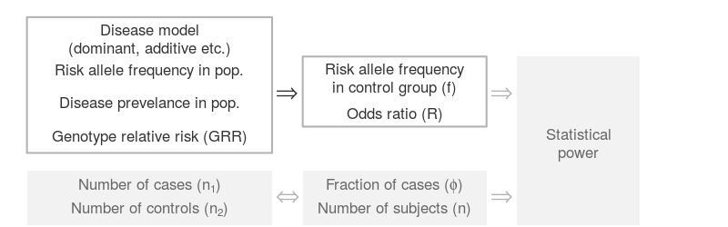

```{r setup, echo=FALSE}
library(kableExtra)
```


The disease model converter translates disease models into the canonical parameters: risk allele frequency in the control group, and odds ratio between allele variants.

Each method of specification has its own advantages.
While the disease models may generate additional insights into the biological process, the canonical parameters are sufficient for the purpose of power analysis. 
We elaborate on their relationships in [Help  &#8594; Disease Models Revisited](disease_models_revisited.html){target="_blank"}, where we also enumerate some arguments for directly specifying the canonical parameters.

<!--
- They do not suffer from compatibility issues.
- They are readily available from [GWAS catalogs](https://www.ebi.ac.uk/gwas/){target="_blank"}.
- They enables unified analysis and systematic reviews.
--->

<!--  
<center>

</center>
<br />
--->

<!--  {width=80%}  -->

