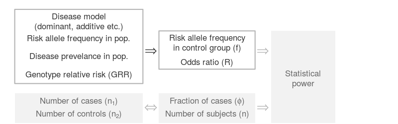

```{r setup, echo=FALSE}
library(kableExtra)
```

In power analysis of genetic association studies, disease models are used to specify the distribution of observations under the alternative hypothesis.
In this document, we discuss the challenges in disease model specifications, and discuss its relationship with an alternative approach that accomplishes the same goal through a set of "cannonical parameters".

# A quick review of power analysis

We shall first briefly recall the main steps of a typical power analysis for genetic association studies.

## Disease model specifications

A typical power analysis for genetic association studies begin by specifiying an alternative hypothesis through a disease model (dominant, recessive, multiplicative, additive, etc.), which assumes:

- The genotype relative risks (GRR).
- Risk allele frequency in the general population (p).
- Disease prevalence in the general population (Prev).

The disease model and parameters determine the joint distribution of the genotypes and phenotyes *in the population*, shown in the following table.

```{r echo=FALSE}
dt <- data.frame(matrix(c("Cases", "$\\pi_{10}$", "$\\pi_{11}$", "$\\pi_{12}$",
                          "Controls", "$\\pi_{20}$", "$\\pi_{21}$", "$\\pi_{22}$"), byrow = T, nrow = 2))

colnames(dt) <- c("Population Prob.", "0 copies", "1 copy", "2 copies")

kable(dt, "html", escape = FALSE, align = "c") %>%
  kable_styling(bootstrap_options = c("hover", "responsive"), full_width = F) %>%
  add_header_above(c(" " = 1, "Risk allele copies" = 3))
```

In the disease models, the conditional probabilities of having the disease, given the risk allele copy numbers, satisfy the following relations,

$$
\frac{\pi_{10}}{\pi_{10} + \pi_{20}} : \frac{\pi_{11}}{\pi_{11} + \pi_{21}} : \frac{\pi_{12}}{\pi_{12} + \pi_{22}}
= \begin{cases}
1 &: \;\;\text{GRR} &: \;\;\text{GRR}^2, &\text{Multiplicative} \\
1 &: \;\;\text{GRR} &: \;\;2\times\text{GRR}-1, & \text{Additive} \\
1 &: \;\;\text{GRR} &: \;\;\text{GRR}, & \text{Dominant} \\
1 &: \;\;\;\;\;1 &: \;\;\text{GRR}, & \text{Recessive}
\end{cases}
$$

where GRR is strictly greater than 1 under the alternative, and equal to 1 under the null hypothesis.

The disease prevalence determines the sum of the probabilities of cases in the population,

$$
\pi_{10} + \pi_{11} + \pi_{12} = \text{Prev}.
$$

The risk allele frequency in the general population, p, assuming [Hardy-Weinberg equilibrium](https://en.wikipedia.org/wiki/Hardy%E2%80%93Weinberg_principle){target="_blank"}, satisfies 

$$
\pi_{10} + \pi_{20} = (1-p)^2, \quad \pi_{11} + \pi_{21} = 2p(1-p), \quad \pi_{12} + \pi_{22} = p^2.
$$

The population probabilities $(\pi_{10},\ldots,\pi_{22})$ are determined by the disease model and its parameters (GRR, Prev, and p), and are solved for using the three equations above.

## Sampling adjustments

Next, the probabilities of observing each genotype-phenotype combination are adjusted according the number of cases and controls recruited *in the studies*, where the sample sizes are specified with

- The number of cases ($n_1$) and controls ($n_2$), or equivalently, the fraction of cases ($\phi$) and total number of subjects ($n$).

```{r echo=FALSE}
dt <- data.frame(matrix(c("Cases", 
                          "$\\pi_{10}\\frac{\\phi}{\\text{Prev}}$", 
                          "$\\pi_{11}\\frac{\\phi}{\\text{Prev}}$", 
                          "$\\pi_{12}\\frac{\\phi}{\\text{Prev}}$",
                          "Controls", 
                          "$\\pi_{20}\\frac{1-\\phi}{1-\\text{Prev}}$", 
                          "$\\pi_{21}\\frac{1-\\phi}{1-\\text{Prev}}$", 
                          "$\\pi_{22}\\frac{1-\\phi}{1-\\text{Prev}}$"), byrow = T, nrow = 2))

colnames(dt) <- c("Prob. in study", "0 copies", "1 copy", "2 copies")

kable(dt, "html", escape = FALSE, align = "c") %>%
  kable_styling(bootstrap_options = c("hover", "responsive"), full_width = F) %>%
  add_header_above(c(" " = 1, "Risk allele copies" = 3))
```

As an example, if $\phi > \text{Prev}$, the probabilities are adjusted to account for over-sampling of cases.

The relative frequencies of allele type-phenotype combinations *in the study* are then calculated as follows.

```{r echo=FALSE}
dt <- data.frame(matrix(c("Cases", 
                          "$\\phi \\left(\\frac{\\pi_{12}}{\\text{Prev}} +
                          \\frac{\\pi_{11}}{2\\times\\text{Prev}}\\right)$", 
                          "$\\phi \\left(\\frac{\\pi_{11}}{2\\times\\text{Prev}} +
                          \\frac{\\pi_{10}}{\\text{Prev}}\\right)$", 
                          "",
                          "Controls", 
                          "$(1-\\phi) \\left(\\frac{\\pi_{22}}{1-\\text{Prev}} + 
                          \\frac{\\pi_{21}}{2(1-\\text{Prev})}\\right)$", 
                          "$(1-\\phi) \\left(\\frac{\\pi_{21}}{2(1-\\text{Prev})} + 
                          \\frac{\\pi_{20}}{1-\\text{Prev}}\\right)$", 
                          ""), byrow = T, nrow = 2))

colnames(dt) <- c("Prob. in study", "risk allele", "non-risk allele", "")

kable(dt, "html", escape = FALSE, align = "c") %>%
  kable_styling(bootstrap_options = c("hover", "responsive"), full_width = F) %>%
  add_header_above(c(" " = 1, "Allele variant" = 2, " " = 1))
```

To simplify notation, we denote the relative frequencies of allele type-phenotype combinations with $\mu = (\mu_{11}, \mu_{12}, \mu_{21}, \mu_{22})$.

```{r echo=FALSE}
dt <- data.frame(matrix(c("Cases", "$\\mu_{11}$", "$\\mu_{12}$", "$\\phi = \\mu_{11} + \\mu_{12}$",
                          "Controls", "$\\mu_{21}$", "$\\mu_{22}$", "$1-\\phi = \\mu_{21} + \\mu_{22}$"), byrow = T, nrow = 2))

colnames(dt) <- c("Prob. in study", "risk allele", "non-risk allele", "Total by phenotype")

kable(dt, "html", escape = FALSE, align = "c") %>%
  kable_styling(bootstrap_options = c("hover", "responsive"), full_width = F) %>%
  add_header_above(c(" " = 1, "Allele variant" = 2, " " = 1))
```

## Power calculations of association tests

Finally, the power of an statistical test is calculated as the probability of (a correct) rejection, assuming that the data (i.e., tabulated counts of the allele type-phenotype combinations) follow a multinomial distribution with probability matrix $\mu$ and sample size $2n$, since each individual has a pair of alleles.

Some common association tests include the likelihood ratio test, Pearson's chi-square test, tests of zero slope coefficient in logistic regressions, as well as t-tests for equal proportions.
In principal, power analysis has to be tailored to the association test used.
Fortunately, many of these tests are asymptotically equivalent in terms of power, and results of the power analysis applies to all equivalent tests. 
We refer users to [Unified Power Analysis](unified_power_analysis.html){target="_blank"} for further details.

These steps form the basis of the calculations implemented in the most existing tools (including the [GAS calculator](http://csg.sph.umich.edu/abecasis/cats/gas_power_calculator/){target="_blank"},
where a (terse) documentation of their [implementation](https://github.com/jenlij/GAS-power-calculator/blob/master/gas_power_calculator.js){target="_blank"} is available [here](https://github.com/jenlij/GAS-power-calculator/blob/master/equations_gas_power_calc.pdf){target="_blank"}). 
Although not explicitly stated, the GAS calculator assumes the test of association to be the Welch t-test for equal proportions.

<!-- **Caveat:** The final step in the power calculations does not apply to association tests performed directly on the 2-by-3 contingency tables of phenotype-genotype combinations (e.g., the [Cochran-Armitage test](https://en.wikipedia.org/wiki/Cochran%E2%80%93Armitage_test_for_trend){target="_blank"}).
Therefore, the GAS calculator should not be used if these tests are to be applied. --->

# Two modeling approaches

In the power calculations outlined above, the disease models are used to describe the distribution of the data under the alternative hypothesis.
Specifically, they are used to specify the conditional distributions of the allele variants, given the phenotypes.
The probability of observing a risk allele in the control group,
$$
f := \mathbb{P}[\,\text{risk allele}\,|\,\text{control group}\,] 
= \frac{\mu_{21}}{1-\phi} 
= \frac{\pi_{22} + \pi_{21}/2}{\pi_{22} + \pi_{21} + \pi_{20}},
$$
is fully determined by the disease model.
Similarly, the odds ratio between the two allele variants, 
$$
R:=\frac{\mu_{11}\mu_{22}}{\mu_{12}\mu_{21}} 
= \frac{(\pi_{12} + \pi_{11}/2)(\pi_{20} + \pi_{21}/2)}{(\pi_{10} + \pi_{11}/2)(\pi_{22} + \pi_{21}/2)},
$$
is also determined by the disease model and its parameters.

In turn, the parameters $(f, R)$, together with the sample sizes $(\phi, n)$, fully describe the distribution of our data under the alternative hypothesis (by determining the probability vector $\mu$ and the sample size $n$).
Power of association tests, therefore, depends on (and only on) the set of "canonical parameters":

- Risk allele frequency among the controls (f).
- Odds ratio (R) of having the defined trait between the two allele variants.
- One of the two equivalent ways of parametrizing the sample sizes.

The following diagram illustrates the common process of power analysis implemented in existing power calculators.

<center>
{width=90%}
</center>
<br />

**Caution**: we remind readers that the risk allele frequency in the control group ($f$) is not the same as the risk allele frequency in the general population ($p$); odds ratio ($R$) is also a very different quantity from genotype relative risk (GRR).

It is worth noting that the mapping from the disease model and its parameters to the canonical parameters ($f, R$) is many-to-one.
That is, different disease model specifications may lead to the *same* distributions of the allele variant counts.
From a statistical perspective, the disease models that map to the same set of canonical parameters are equivalent in terms of power. 

We provide users with a "Disease Model Converter", and demonstrate this equivalence among disease models with an example in the application.

#### In power calculations, we can either describe the alternative hypothesis with a disease model, or through the canonical parameters ($f, R$). Both approaches are sufficient for the purpose of power analysis.

While the disease models may carry additional insights into the biological process, the canonical parameters also have their unique advantages.
We offer an incomplete list of comparisons of the two approaches, and discuss their usage in practice.

## Interpretability and communicability

In general, geneticists and biostatisticians seem to agree that disease models are more transparent to interpretations.
The concept of genotype relative risks, in particular, seems easier to reason about than odds ratios in the canonical parameters definition.
Disease models also seem to be the de facto mode of model specification when performing power analysis for study planning and grant applications.

The "nonparametric" approach to model specification through the canonical parameters is somewhat lesser known to the statistical genetics community.
The canonical parameters are typically estimated and reported as outcomes of the research, but not used as inputs to the power analysis for planning purposes.

## Availability of parameter estimates

The canonical parameters $f$ and $R$ can be estimated from data collected in the study.
They are also reported and curated in GWAS catalogs such as the [NHGRI-EBI Catalog](https://www.ebi.ac.uk/gwas/){target="_blank"}.

On the other hand, accurate information regarding the disease model parameters can be more difficult to obtain, partly because some parameters in the disease models cannot be estimated from the association studies alone.

In particular, disease prevalence in population (Prev), as well as RAF in population ($p$), must be obtained from other studies or surveys targeting the general population; the association studies, which usually themselves oversample the cases, do not produce estimates.
Genetic association studies also rarely report the disease model and its parameters estimates.
In fact, we are not aware of a GWAS catalog that reports and curates the disease models and their estimated parameters.

This is paucity of information on disease model parameters is not an issue if we are planning to study a trait for which we have little prior knowledge.
In this case, the purpose of power analysis is to determine the range of models and parameters that lead to discovery of associations, given the study designs.

In contrast, in confirmatory / follow-up studies and systematic reviews, our main interest is in the statistical validity of the reported findings.
Power analysis then serves to find efficient designs, and to validate the claims made.
Knowledge obtained in prior studies (in the form of parameter estimates) are indeed necessary.

## Robustness against model misspecification

Disease models are useful in as mush as they help us understand the biology behind the data we observe.
Unfortunately, like all models, they can be misspecified. 
For example, the following genotype relative risks,
$$
\frac{\pi_{10}}{\pi_{10} + \pi_{20}} : \frac{\pi_{11}}{\pi_{11} + \pi_{21}} : \frac{\pi_{12}}{\pi_{12} + \pi_{22}}
= 1 : 3 : 4,
$$
does not follow any of the common disease models.
In this case, different studies may come up with different disease models (say, Dominant and Additive), and of course, different parameter estimates.

Suppose a researcher wishes to perform a meta analysis or confirmatory experiment of the existing results, where the literature reports inconsistent estimates of disease models and parameters,
she / he would a have a difficult time pooling the information from these different sources. 
And even when they are pooled, the resulting model usually does not fall in one of the familiar categories --- there is no existing tool with which to perform power analysis.
The researcher will likely have to forgo the information from one model, and use estimates from only the other.

On the other hand, the canonical parameters are invariant to the disease model choices, and accommodate models falling outside the usual categories. 
They can also be easily combined to produce pooled estimates.
This universality allows us to perform power analysis in a unified fashion, regardless of the disease models assumed.
This also paves the way for the "OR-RAF diagram", as well as systematic reviews of statistical validity of existing studies.

## Robustness against human errors

The disparity in availability of parameter estimates we mentioned earlier can lead to unintended consequences, one of which is potentially incorrect usage of power calculators.

This issue, although minor, affects correctness of the results from power analysis.

Recall that the specification of a disease model requires as input the risk allele frequency (RAF) in the general population ($p$).
The RAF reported in the [NHGRI-EBI Catalog](https://www.ebi.ac.uk/gwas/){target="_blank"}, in contrast, refers to RAF in the control group ($f$).
With RAF in population often unavailable, it is tempting to substitute the RAF in control group into the calculations.
While the two quantities may be close when diseases prevalence and penetrance are low, their difference becomes non-negligible if either of the two conditions are violated, leading to grossly distorted results.

Performing power analysis with the canonical parameters is a not sure-fire way to prevent this human error (as the converse could also happen).
However, it is perhaps more robust to such mistakes, since what is readily available matches with what is required as input.

## Compatibility of parameters

We make another minor comment regarding correct usage of disease models.

<!-- We mentioned above that the mapping from the disease models to the canonical parameters is many-to-one, therefore making the disease models unidentifiable from the allelic tables. -->

We caution users that not all values of the disease model parameter combinations are valid.
For example, in a multiplicative model, the parameters 
$$
p = 0.1, \quad \text{Prev} = 0.5, \quad \text{GRR} = 1.5,
$$
would result in the conditional probability of having two risk allele copies greater than 1.
(In this case, the [GAS calculator](http://csg.sph.umich.edu/abecasis/cats/gas_power_calculator/){target="_blank"} would produce the error message: "I don't like the genetic model you requested!", without explicitly pointing to the compatibility issue.)

Although an experienced geneticist would immediately notice the impossibility of the disease model parameter combinations, these contradictions may not be obvious to the untrained eye.
The end user of the software -- experienced or not -- is ultimately responsible for inputting valid values when specifying a disease model.

On the other hand, any combination of 
<!-- $$f\in(0,1), \quad R\in(0,+\infty), \quad \phi\in(0,1), \quad \text{and} \quad n\in\mathbb{N_+}$$ --->
$$f\in(0,1), \quad \text{and} \quad R\in(0,+\infty)$$ 
is valid. 
Parameter compatibility is not an problem for the set of canonical parameters.

# When to use which?

We believe that either approach may be preferred, depending on the use cases.
Recall that power analysis is useful in at least three scenarios:

1. *In planning for an exploratory study, where little is known about the associations.* 

    In this case, the model parameters are unknown to the researcher. The goal is to find out the range of disease models and parameters that are discoverable given the study designs. Power analysis is also to some extent exploratory in nature.

2. *In planning for a confirmatory study, where something is known about the associations and one wishes to validate the findings with an efficient design.*
    
    In this case, the model parameters or the canonical parameters Are known, and the study design variables are what we are solving for. The goal of power analysis is to provide a set of efficient study designs with sufficient power.

3. *In reviewing the reported findings and verify the statistical validity of the claims made.*

    In the third case, one looks to find out whether the claims of statistical significance are congruent with the evidence from data. A claim supported by very weak or contradictory evidence should invite further investigations. In this case, both the parameter estimates and the study designs have to be available.

In view of the discussions above, we propose the following general guideline for power analysis in genetic association studies.

- When designing an association study where little to no prior information is available: 
    - Either approach is valid.
    - Disease models are easier to interpret and communicate.
- When designing a follow-up / confirmatory study, or conducting a systematic review:
    - Choose the approach for which the parameter estimates are available, or of better quality.
    - Typically the canonical parameters are better estimated, reported, and curated.

There are, of course, exceptions to these rules.
The minor comments we made about the two approaches should not be taken as criticisms, but rather as reminders of the potential pitfalls in power analysis.
In either approach, care needs to be exercised in order to produce valid results.

