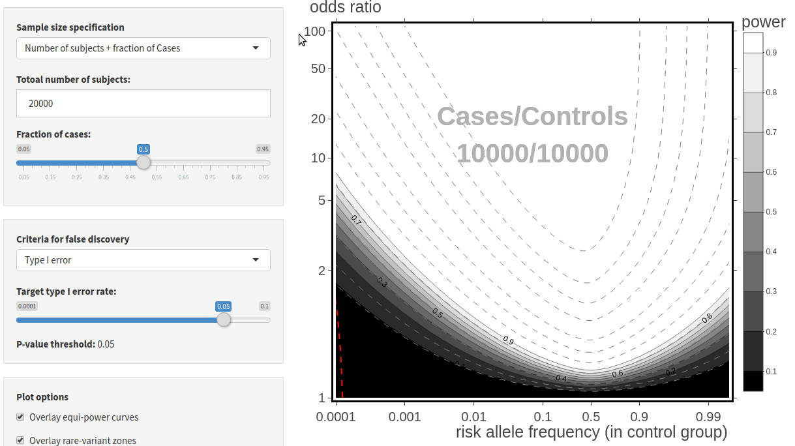
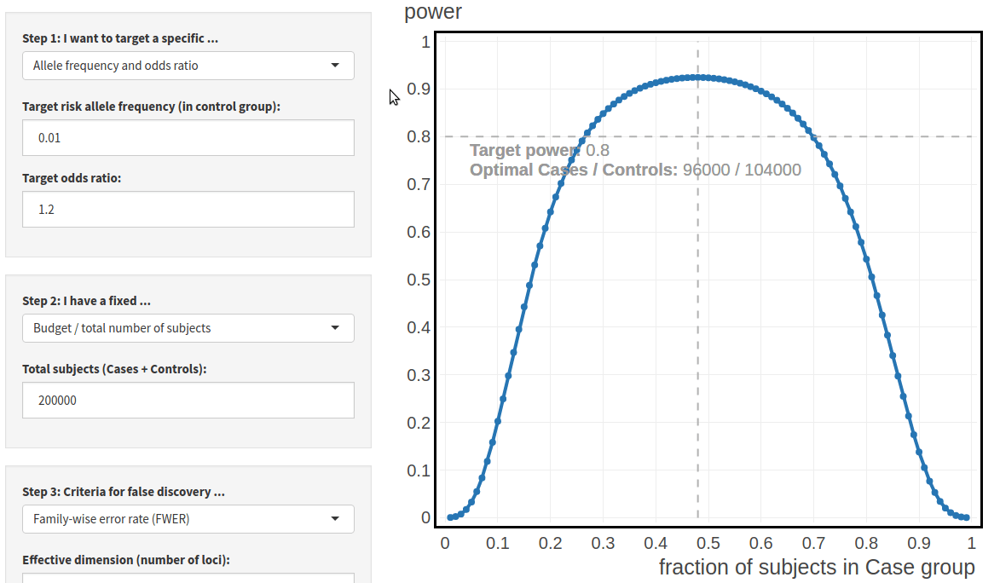

# User Guide

## The OR-RAF diagram

U-PASS calculates statistical power based the core parameters common to models of qualitative traits:

- Sample sizes, i.e., the number of cases, $n_1$, and controls, $n_2$,
- Conditional distribution of risk variant among controls, i.e., risk allele frequency (RAF) in the control group.
- Odds ratio (OR) of having the defined trait between the two allele variants.

Users need only prescribe the sample sizes, by one of two ways provided in the first box, 
i.e., total sample size + fraction of cases, or number of cases + number of controls.

Statistical power of familiar association tests, including the likelihood ratio test, chi-square test, Welch's t-test, and LR test for logistic regressions, have the same asymptotic power curves
(see the [documentation](U-PASS_documentation.html#a_test-independent_power_analysis){target="_blank"} for details).
This common power limit is calculated as a function of RAF and OR, and visualized as a heatmap in the OR-RAF diagram. 

{width=90%}

 

## Interactively explore reported findings in the NHGRI-EBI Catalog

We provide options for users to load and overlay findings reported in the [NHGRI-EBI GWAS Catalog](https://www.ebi.ac.uk/gwas/home){target="_blank"}, or upload data from other sources compliant with the Catalog's data format.

A quick reference for the diagram with data overlay:

- Circles: reported associations
    - red: user selected loci
    - orange: findings reported in the same study as the user selected loci
    - blue: findings reported in studies other than the one selected
    
- Greyscale heatmap: OR-RAF power diagram of association tests
- red dashed lines: rare-variant threshold.
We recommend specifying the threshold by the [minimum calibration numbers](U-PASS_documentation.html#finite-sample_corrections){target="_blank"}. 
    - left (if present): the minimum risk variant count needed for the asymptotic approximations to apply.
    - right (if present): the minimum non-risk variant count needed for the asymptotic approximations to apply.
    
The initial sample sizes are dynamically adjusted, and automatically determined from texts of the article reporting the user selected loci.

Information of the selected loci and the study is also dynamically displayed below the diagram.

{width=60%}

 

## Review and forensics of reported findings 

The unified power analysis allows us to examine results from different studies employing different models and applicable tests, in the same diagram, with the same power limits.
It allows for a systematic review of reported findings for their statistical validity. 

In particular, a reported association predicted to have low power given the study's sample size -- lying in the dark regions of the OR-RAF diagram -- while not impossible, invites further scrutiny. 
It should be noted that a reported association predicted to have high power is not automatically accurate, as survival bias induced by multiple testing may inflate the reported OR and RAF estimates.

Studies where reported associations show misalignment with the predicted powered curves may be further investigated for potential problems in the data curation process.
The following figure shows one such study, where gross misalignment was identified.

{width=60%}

We reached out to the authors of the study [@dominguez2018pilot], who confirmed that the RAF reported in the Catalog were based on all subjects in the study, as opposed to only the control group,
while the Catalog requires that [RAF be reported in the control group only](https://www.ebi.ac.uk/gwas/docs/fileheaders){target="_blank"}.
As a consequence, the RAFs are systematically overestimated, shifting the reported findings to the right in the diagram.

In general, we expect this aspect of our software to be useful for discovering problems with data entry and catalog curation process, as well as for assessing the reproducibility and robustness of reported findings.

## Find optimal study designs

We provide three ways to perform power analysis, depending on the contraint of the study design.

- If the contraint is the total budget, i.e., total number of subjects recruited,
    - power is calculated as a function of the fraction of cases.
- If the contraint is the number of cases,
    - power is calculated as a function of the number of controls.
- If the contraint is the fraction of cases, 
    - power is calculated as a function of the total number of total subjects.

{width=100%}

 

The power analysis tool uses the targeted RAF and OR directly to calculated optimal study designs.
This allows us to bypass the disease models which define these two quantities implicitly.
Indeed, when designing a study to replicate a reported finding, the core quantities RAF and OR are alaways available in GWAS catalogs, while disease models are often not reported in the literature.
See [more arguments in the documentation](U-PASS_documentation.html#a_model-invariant_parametrization){target="_blank"} on why we prefer to specify these two quantities directly.

Type I error control criteria may be specified in terms of [family-wise error rate](https://en.wikipedia.org/wiki/Family-wise_error_rate){target="_blank"} or [type I error](https://en.wikipedia.org/wiki/Type_I_and_type_II_errors){target="_blank"}.

Target non-discovery rate may be specified in terms of [power / type II error](https://en.wikipedia.org/wiki/Type_I_and_type_II_errors){target="_blank"}, or the more stringent family-wise non-discovery rate, i.e., the probablity of not detecting any one of the loci with equal or stronger signal.

# References